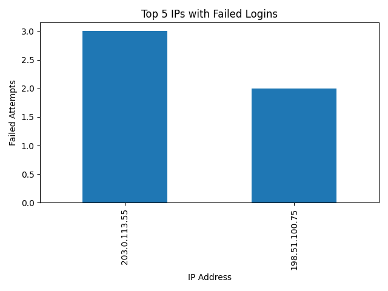

# 🛡️ Cybersecurity Log Analysis Project (Mini Data Warehouse)

A mini data warehouse project that extracts, transforms, and analyzes authentication logs to detect potential brute-force attacks and generate daily reports with geo-location mapping.

## 📁 Project Structure

```
Cybersecurity Log Analysis Project/
│
├── etl_auth_logs.py           # ETL script: Load CSV logs into PostgreSQL
├── analyze_auth_logs.py       # Analysis script: Detect brute-force attacks, plot charts
├── email_report.py            # Sends  email with analysis report and map
├── attackers_map.html         # Interactive map of attack source IPs
├── Figure_1.png               # Bar chart of top failed login IPs
├── auth_logs.csv              # Sample authentication logs
├── report.pdf                 # Final project report (with charts and explanation)
└── README.md                  # Project documentation
```

## 🧠 Features

- 🔄 **ETL Process**: Parses CSV authentication logs and stores them in PostgreSQL.

- 📊 **Analysis**:
  - Detects repeated failed login attempts (potential brute-force attacks).
  - Visualizes top offending IPs.

- 🌍 **Geo-Mapping**:
  - Locates suspicious IP addresses on a map using IP geolocation.

- 📧 **Email Automation**:
  - Sends a daily report with attached analysis and location map.
  
## ⚙️ Requirements

- Python 3.11+
- PostgreSQL (with a `cyber_db` database)
- Required Python packages:
  - `pandas`
  - `psycopg2`
  - `matplotlib`
  - `folium`
  - `geocoder`
  - `smtplib` (built-in)
  - `email` (built-in)

Install Python dependencies with:

```bash
pip install pandas psycopg2-binary matplotlib folium geocoder
```

## 🚀 How to Run

1. **Load Data into PostgreSQL**  
   Update DB credentials inside `etl_auth_logs.py` and run:

   ```bash
   python etl_auth_logs.py
   ```

2. **Run Analysis & Generate Visuals**

   ```bash
   python analyze_auth_logs.py
   ```

   This will:
   - Detect brute-force IPs
   - Generate `Figure_1.png` (bar chart)
   - Generate `attackers_map.html` (geo-map)

3. **Send Daily Email**

   ```bash
   python email_report.py
   ```

   Make sure:
   - App password for Gmail is set
   - Your email address is configured in the script

## 📌 Example Output

### Top 5 Failed Login IPs (Chart)



### Geo-Map (HTML)

> Open `attackers_map.html` in your browser to view source locations of suspicious login attempts.

## 📄 Report

See [report.pdf](report.pdf) for the detailed documentation, visuals, and analysis summary.

## 👨‍💻 Author

**Pranav Panchwagh**  
<!-- Cybersecurity & Python Developer   -->
Email: `panchwaghpranav13@gmail.com`

## 📬 License

This project is for educational use only. 

